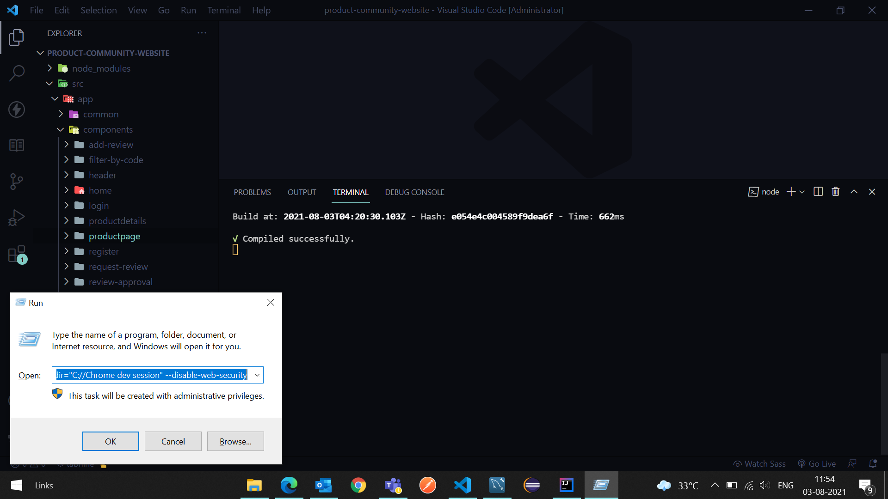
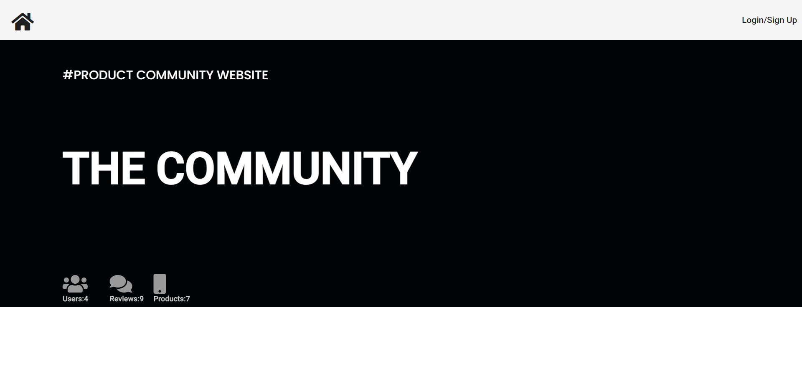

1.Press Windows+r key and paste 
    
chrome.exe --user-data-dir="C://Chrome dev session" --disable-web-security

2.Run Angular app on this chrome version which will be opened after running the above command.

3.By default role of a customer would be User. Please change the database entry inside usercredentials 
  table under role column if you want make some one Admin 

4.In ask for reviews section time of redirection has been changed from 30 sec to 5 sec

5.Products should be added manually in databse

# 1.Run command given above

# 1.APP 2(Spring-boot) RUNNING ON SERVER PORT:3000

# Database showing which users are admin

# Home page showing stats

# Signup ui

# Login as Admin

# Approve review page only accessible to admin

# Submit if want to approve the review

# Login as User

# Ask for Review and product section 

# Ask for Review ui

# Product page ui

# Product plus review page (with average customer rating and number of reviews of only approved reviews)

# Filter by brand(Apple)

# Filter by name

